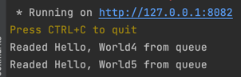
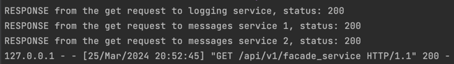

Hazelcast cluster with 3 nodes were initialised for both hash_map and messaging_queue.


Run 7 POST requests to the facade service:

Messages services:




Logging services:


Facade service:


Run GET request to the facade service:

Result:
```json
{
  "Result": "Success",
  "msgs": "Hello, World2Hello, World5Hello, World7Hello, World3Hello, World4Hello, World7Hello, World6Hello, World1Hello, World1, Hello, World2, Hello, World3, Hello, World6, Hello, World7Hello, World4, Hello, World5"
}
```

Facade service logs:

