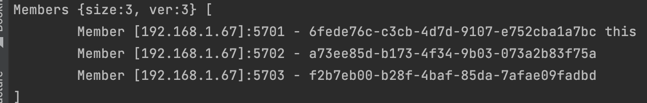

Code was distributed in the separate folders, according to the multilayer architecture. The main folder contains the main code, and the subfolders contain the code for the corresponding layers.

Lunch hazelcast cluster:


Lunch 10 POST requests to the server:


So we can see that all requests were successfuly processed by the facade service, and then distributed between 3 logging services,
first one receive 3 requests, second one 4 requests, and the third one 3 requests.
Data was stored in the hazelcast cluster.
Messages service didn't receive any requests, as expected.

Then let's execute GET request to the facade service:
```json
{
  "Result": "Success",
  "msgs": "Hello, World8Hello, World7Hello, World4Hello, World6Hello, World9Hello, World5Hello, World1Hello, World10Hello, World3Hello, World2Not implemented yet."
}
```


Disable 2 logging services:


Result:
```json
{
  "Result": "Success",
  "msgs": "Hello, World8Hello, World7Hello, World4Hello, World6Hello, World9Hello, World5Hello, World1Hello, World10Hello, World3Hello, World2Not implemented yet."
}
```


